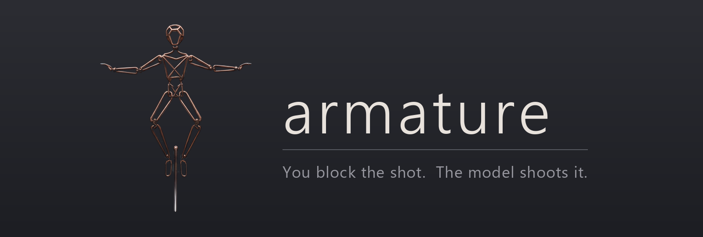

  

#

**You block the shot. The model shoots it.**

**[Landing page & handbook →](https://mcp-tool-shop-org.github.io/armature/)**

A video model can produce motion, light and life that no renderer can. It cannot be told *who
is on screen and where they are standing*. armature supplies exactly that: a canonical
character mesh is staged and animated in headless Blender, and the render becomes a per-frame
**control sequence** the video model must obey — so AI-generated video can carry one persistent
main character whose position and pose are known every frame.

Stage your character in Blender. Render the control sequence. Let the video model paint the life
over it. Structure comes from geometry you own; life comes from the model; identity is a named,
versioned thing that rides in the prompt and the reference stack — never an accident of a lucky
frame.

---

## State: the thesis is under test, and three things are measured

Founded **2026-08-10**. Five experiments closed, **22 generations spent**. The thesis is no longer
untested: parts are measured, one part is confirmed blocked, and the part that matters most is
still judged by eye and still open. A repo-wide audit of the first arc is at
[docs/audit-first-arc.md](docs/audit-first-arc.md).

| | |
|---|---|
| Experiments | **5 closed** — E01 exporter · E02 first contact · E03 authored motion · E04 the noise floor · E06 reference-onto-schematic. E05 withdrawn on a falsified premise |
| Generation probes | **22** |
| Credits | **88** projected, at the measured 4 per generation |
| License map | **9 rows UNVERIFIED and treated as NO**; every other row carries a retrieved license document |
| Tests | **262**, passing under `-O` |
| Public surfaces | **live** — [landing page + handbook](https://mcp-tool-shop-org.github.io/armature/), CI and Pages green |

### What is measured

- **A rendered control sequence governs where the figure is, at what scale, and when it moves.**
  Both control arms track the control; the no-control arm does not (E02).
- **Control governs authored subject motion, categorically** — an 85.0° arm sweep against 0.062°
  when the same control is held still (E03).
- **Control owns the outline; the reference owns surface, material and costume** (E06). The
  reference can *extend* a silhouette only where the control is silent — horns above the head, yes;
  the limbs, no.
- **Inverting the depth control end-to-end does not break tracking.** The model reads the
  *geometry*, not the tone; a 233-level swing in control luma moved output luma by 11.7 (E02).

### What is not

- **Whether the figure on screen is the same character.** Canon, judged by eye, and no metric here
  approximates it. Open.
- **A real character performing.** A control's silhouette becomes the body, so a wire-armature
  control returns a wire-armature body wearing armour. Authored motion on a character needs a
  **rigged character mesh** — the blocking dependency, confirmed twice, and the next work.
- **A threshold for reading a gap.** E04 measured the between-generation floor — **SD ≈ 0.16** on
  the tracking statistic at 33 frames, against a fixed-seed floor of **exactly zero** — so gaps are
  now quoted in units of it. That is a *unit*, deliberately **not** a significance rule: the
  Director's eye still rules on the artifact, and E02's unread 0.060 gap turns out to be 0.37 SD.

A negative answer remains a full success here, and the roadmap said so before any evidence arrived.

## How this repo works

- [CLAUDE.md](CLAUDE.md) — how to work here: the three roles, the rules each seat runs under,
  and the non-negotiables (the license gate, bounded credits, identity is judged by eye).
- [docs/ROADMAP.md](docs/ROADMAP.md) — the whole build, session by session, with the drift
  tripwires named in advance.
- `docs/experiments/` — every non-trivial change runs as a numbered experiment:
  **spec before the work → report after → advisor ruling last.**
- `docs/license-map.md` — the verified commercial-use map. Nothing enters the pipeline without
  a retrieved license document.

The method is inherited from [facet](../facet), where it was paid for: in facet's founding
session six inherited claims were falsified, each in minutes, because each sat next to runnable
code. armature is downstream of facet — facet cuts and paints the figure; armature stages and
performs it.

## Standing rules that shape everything here

**No non-commercial models, ever — including in experiments.** CC-BY-NC, research-only and
academic-only licenses are banned outright. A conclusion drawn on a banned model is a
conclusion that has to be thrown away, so it never starts.

**Metrics are diagnostics; the Director judges.** Whether the figure on screen is the same
character is canon, and no metric approximates it. Every generating experiment builds a
**control | output | reference | provenance** sheet before a single number is quoted.

**Cloud credits are bounded before they are spent.** Spent credits have no undo, so every spec
states its ceiling per arm in advance.

## License

MIT — see [LICENSE](LICENSE). The license of any *model* used through this tool is a separate
question, tracked in `docs/license-map.md`.
